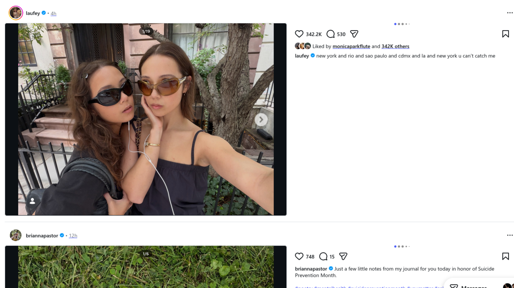

# Instagram Desktop Site

A Stylus userstyle that rebuilds Instagram's desktop layout around the media: two-column feed, larger photos, carousels and reels. Layout widths, media size caps, the caption column, font size and line spacing are all adjustable.



## What it changes

**Feed.** The feed column widens to a share of the window rather than sitting at Instagram's fixed width. Each post becomes two columns — media on the left, caption and comments beside it — falling back to stacked when the window is too narrow to give the caption its minimum. Photos drop Instagram's crop-to-fill box and are sized to their own proportions, so nothing is cut off and no blurred plate is drawn behind them. Carousels are enlarged to fit the wider column. Portrait reels, which Instagram flattens into a 4:5 box and crops, are given back more of their height. Instagram's box is the same whether the reel is 9:16 or shallower, so a 3:4 or 4:5 reel is treated as 9:16 here and loses some width in exchange — a deliberate trade, described under [Known limitations](#known-limitations). A landscape reel is sized to its own proportions instead, and follows the same width and height caps. The right-hand rail is hidden by default, and can be brought back from a setting.

**Post pages** (`/p/<id>/` and `/<user>/p/<id>/`). Carousels are enlarged and the column widened to hold them beside a caption. Single photos get the more useful fix: Instagram lays them out two different ways depending on shape, so a tall photo comes out smaller than a carousel in the same place while a square one grows without limit. Neither is sized directly — what the settings govern is the column holding photo and caption, and the width of the caption column within it. The photo takes what is left, which is the same width whatever its shape. Landscape photos are deliberately left alone — Instagram's own layout for them is already good.

**Reel pages** (`/<user>/reel/<id>/`, and reels reached through either `/p/` path). A 9:16 reel is enlarged, with its width and its height each adjustable — whichever is tighter decides the size, and the video keeps its true proportions at every value. A portrait reel that is not 9:16 takes the same two settings and keeps its proportions just as well, but stops short of the height you set rather than filling it; how far short is under [Known limitations](#known-limitations). A square or landscape reel is enlarged too, through a width setting of its own. Every post shape is reachable at a `/reel/` URL, not only reels, so all of the above applies there as well.

**Text.** Size and line spacing for usernames, captions and comments, on all of the above. Both start at Instagram's own values, so nothing changes until you move a setting.

## Requirements

[Stylus](https://add0n.com/stylus.html) — this is a UserCSS style, not a stylesheet you can drop into a browser on its own.

**Firefox 126 or newer.** `:has()` needs 121 and `zoom` needs 126. On an older build the declarations are dropped rather than erroring, so the style partly applies and carousels stay at stock size.

Chromium is not restricted, and the style was confirmed working under Stylus for ungoogled-chromium on 2026-09-10. No Chromium version floor has been established, so treat anything older than that as untested.

## Install

Published to [userstyles.world](https://userstyles.world/style/30052/instagram-desktop-site) under the name `Instagram Desktop Site`. Install from there and Stylus will offer updates as new versions are published.

To install this copy instead, open `Instagram.user.css` raw and Stylus will intercept it. Stylus takes that raw URL as the style's update URL, so an install from here follows `main` — which may be ahead of the published version — rather than userstyles.world.

## Coverage matrix — page × media shape

| Page / modal                                              | URL shape                                               | Single photo                       | Carousel                        | Reel                                        |
| --------------------------------------------------------- | ------------------------------------------------------- | ---------------------------------- | ------------------------------- | ------------------------------------------- |
| **Feed**                                                  | `/`                                                     | ✅any ratio                         | ✅ any ratio                     | ✅ 125% box (4:5, 3:4, 9:16), 4:3, 16:9, 1:1, 3:2 |
| **Post / reel permalink**                                 | `/p/<id>/`<br>`/<user>/p/<id>/`<br>`/<user>/reel/<id>/` | ✅1:1, 3:4, 4:5 <br>⭕4:3, 16:9, 3:2 | ✅ 1:1, 16:9, 4:5, 3:4, 4:3, 3:2 | ✅1:1, 9:16, 4:5, 4:3, 16:9, 3:2, 3:4     |
| **Reels, plural path**                                    | `/reels/<id>/`                                          | —                                  | —                               | ❌                                           |
| **Reel floating dialog**                                  | `/reel/<id>/`                                           | —                                  | —                               | ⭕                                           |
| **Post modal over profile grid**                          | `/p/<id>/`                                              | ⭕                                  | ⭕                               | ⭕                                           |
| **Post modal over feed**                                  | `/p/<id>/`                                              | ⭕                                  | ⭕                               | ⭕                                           |
| **Grid pages** (profile, explore, hashtag, saved, tagged) | various                                                 | — thumbnails only                  | —                               | —                                           |
| **Stories**                                               | `/stories/...`                                          | —                                  | —                               | —                                           |

✅ styled  ·  ❌  nothing except font size and line spacing works here  ·  ⭕ the caption column is adjustable; no setting controls the media width, it takes whatever the caption leaves  ·  — shape cannot reach that URL

On the three modal rows ⭕ means the caption and comment column setting, which is the only thing that reaches a modal — plus the slide counter on a modal carousel. The media then takes whatever width the caption gives up, until it reaches the cap Instagram derives from the window height. On a tall narrow window that cap is never reached, so every pixel taken off the caption goes to the media; on a short wide one it is reached early and narrowing further buys nothing.

On the permalink row ⭕ means something different: a landscape photo, which gets everything else the style does — the width ceiling Instagram puts on the post column is lifted, so the photo grows with the window, and the caption column, font size and line spacing settings all apply. It has no width cap of its own because it does not need one: it already sits comfortably within the viewport, and capping it would only make it smaller.

## Settings

Eighteen, all exposed through the Stylus settings pane.

| Setting | Default |
| --- | --- |
| Carousels: a slide counter (3/7) over the media | Shown |
| Feed: the right-hand sidebar (your profile, the account switcher, suggestions) | Hidden |
| Feed: feed width, as a % of the window | 90% |
| Feed: minimum feed width in pixels | 780px |
| Feed: media width, as a % of feed width | 55% |
| Feed: minimum width of caption column before it moves underneath | 320px |
| Feed: maximum height of a single photo or reel | 900px |
| Feed: maximum width of portrait reel | 600px |
| Feed: scale carousels by a maximum of (1 = off) | 1.5 |
| Text: font size of usernames, captions and comments | 14px |
| Text: spacing between lines of that text | 18px |
| Reel/post pages: total width of photo/carousel and caption | 1350px |
| Reel/post pages: total width of a portrait carousel and caption | 1100px |
| Reel/post pages: total width of a portrait reel and caption | 950px |
| Reel/post pages: maximum height of a portrait reel | 1000px |
| Reel/post pages: total width of a square/landscape reel and caption | 1500px |
| Reel/post pages: width of the caption and comment column | 380px |
| Post modal: width of the caption and comment column | 400px |

On the reel and post pages nothing is sized directly. Every width setting there caps the column that holds the media and its caption, and the media takes whatever the caption column leaves it — which is why the caption width belongs in the same group rather than being a separate concern.

The two portrait-reel settings bound the same thing from different directions, and whichever is tighter wins: the width setting caps the column, and the height setting caps it by the width a 9:16 video would need to reach that height. Set either low and the reel simply gets smaller, keeping its proportions.

The feed settings are more literal. The media column is set as a share of the feed width and the caption column takes what is left, and the two caps on feed media — maximum width of portrait reel, maximum height of a single photo or reel — bound the media element itself rather than a column around it.

The post modal — a post or reel opened in a floating panel by clicking it in the feed or reaching it from a profile grid — is sized by Instagram rather than by the page settings above, so its caption and comment column has a setting of its own. Unlike the others it is a fixed width rather than a cap: the column is exactly what you set at every window size, and the media beside it grows into whatever the column gives up. Stock behaviour is a column that drifts between 405px and 500px depending on the space available, so the setting is mostly useful for narrowing it — which is what makes the modal usable in a narrow window, such as a phone browser in desktop mode. It stops at 220px because below roughly that a long username in the comments has nowhere left to wrap.

## Known limitations

- **A portrait reel that is not 9:16 is sized conservatively.** The height setting works out the column a 9:16 video would need, so a shallower portrait reel comes out under its height budget rather than filling it — a 3:4 reel reaches roughly three quarters of the height you set. Landscape reels and 9:16 reels are both exact. It is never sized the wrong way, only short.
- **A portrait reel shallower than 9:16 is cropped left and right in the feed.** Instagram flattens everything taller than 4:5 into one box and crops it to fill, so a 3:4 or 4:5 reel arrives indistinguishable from a 9:16 one and is treated as 9:16 — which costs some of its width at the default, and even more once the width setting is low enough to make the box a true 9:16. 3:4 and 4:5 reels are rare, but they are real. The trade is deliberate: giving a tall reel back its height is the same operation as taking the sides off a shorter one, and nothing on the page distinguishes them. A 9:16 reel is never side-cropped at any setting.
- **The slide counter does not appear when the post is stacked rather than two columns.** The counter is positioned across from the dots onto the media, and that only works while the caption sits beside the media. When the window is too narrow to give the caption its minimum width — or when the media column is set wide enough to squeeze it — the caption drops below the media instead, and the counter goes off-screen rather than moving with it. It is absent, not misplaced: nothing appears in the wrong place. The two layouts need opposite anchors and CSS cannot tell them apart, so this is a deliberate trade rather than an oversight.
- **`/reels/<id>/` is deliberately untouched.** It is a modal with its own markup, which these rules would not transfer to unchanged. The floating reel dialog at `/reel/<id>/` gets the caption and comment column setting and nothing else, for the same reason.

## Repository layout

| Path | Role |
| --- | --- |
| `Instagram.user.css` | The style. The deliverable. |
| tags `v2026.9.12.1` … | Every published version is a git tag on the commit it shipped from. `git show v2026.9.22.1:Instagram.user.css` retrieves one. |
| `Instagram-20260907-uploaded.user.css`, `Instagram-20260910-uploaded.user.css` | The two releases that predate this repository, kept as files because no commit holds them. |
| `CHANGELOG.md` | Release notes per version. Earlier releases in `docs/changelog-archive.md`. |
| `docs/removed.md` | Why something is **not** in the style, by subject, with the evidence. |
| `USw-notes.md` | The user-facing changelog, for the Notes field on userstyles.world. |
| `docs/rule-notes*.md` | Why each rule is written the way it is, and what was measured to get there. The index is in `docs/rule-notes.md`; the notes are split by `@-moz-document` block. |
| `docs/token-overrides.md` | Why the design-token overrides work, and how to measure a token's reach. |
| `verify.py`, `scoped.py` | Verification harness. |

The style itself carries no comments beyond its metadata header — the reasoning lives in `docs/rule-notes.md` and the two files it indexes, keyed by selector. Read the note for a rule before loosening a guard or changing a number.

## Verifying a change

```
python3 verify.py Instagram.user.css                   # check one file
python3 verify.py old.user.css Instagram.user.css      # prove a change altered nothing
python3 scoped.py --urls Instagram.user.css            # every block vs every URL shape
python3 scoped.py --diff old.user.css new.user.css     # every snapshot, at its own URL
```

`verify.py` checks the metadata with `usercss-meta` — the parser Stylus itself uses — then runs a rule and declaration census in headless Firefox to catch silently dropped syntax, and with two files diffs every computed property of every element. It is blind to URL scoping, which is what `scoped.py` covers.

**Neither script runs from a fresh clone.** Both read `Instagram_snapshots/`, which is not tracked — the snapshots are captured logged-in sessions of Instagram. Capture your own with [SingleFile](https://github.com/gildas-lormeau/SingleFile) before verifying.

## License

MIT.
